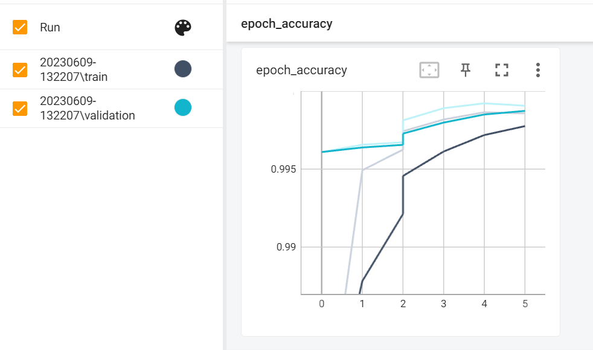
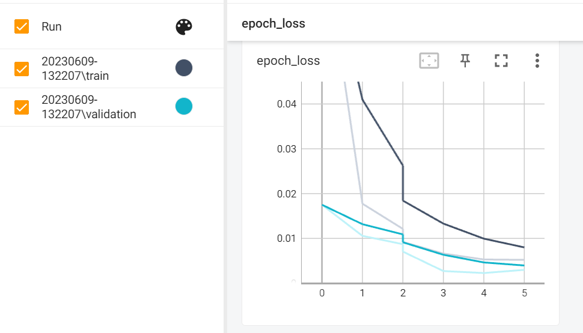
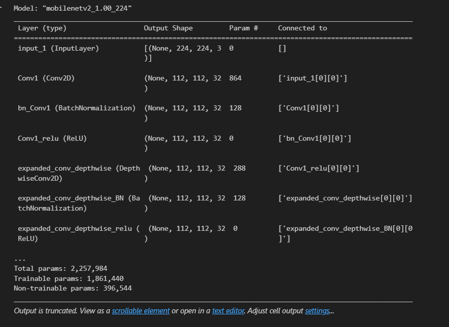

# Concrete Crack Detection

## Project Description
This repository contains the code and resources for a machine learning project focused on detecting cracks in concrete structures. The goal is to develop an image classification model that categorizes concrete images into two classes: "With Cracks" and "Without Cracks". This AI-based solution aims to prevent potential risks to building safety and durability by accurately identifying concrete cracks. The project leverages a dataset from Mendeley and follows a comprehensive machine learning workflow from problem formulation to model deployment.

## Dataset
The dataset used in this project is publicly available at the following link: https://data.mendeley.com/datasets/5y9wdsg2zt/2

## Project Functionality
- Performs image classification to identify concrete cracks.
- Addresses various types of cracks, including hairline cracks, shrinkage cracks, settlement cracks and structural cracks.
- Ensures high model accuracy while avoiding overfitting.
- Utilizes transfer learning with pre-trained models.
- Deploys the model to make predictions on test data.

## Challenges and Solutions
### Challenges:
- Limited availability of labeled concrete crack images.
- Dealing with imbalanced datasets.
- Optimizing model architecture and hyperparameters for accurate classification.

### Solutions:
- Curated and augmented the available dataset to increase the number of crack samples.
- Applied data augmentation techniques to enhance model generalization.
- Leveraged transfer learning with pre-trained models for efficient feature extraction.
- Fine-tuned the model for better performance on concrete crack classification.

## Future Implementations:
- Develop a web application to enable users to upload images for real-time crack detection.
- Explore advanced deep learning architectures to further improve model performance.
- Create a mobile application for on-the-go crack identification.

## Requirements and Dependencies
- TensorFlow (v2.12.0)
- Keras
- NumPy (v1.24.2)
- Matplotlib (v3.7.1)
- Pandas (v1.5.3)
- TensorBoard (v2.12.3)

Install dependencies by using the following command:
```shell
pip install tensorflow==2.12.0
pip install numpy==1.24.2
pip install matplotlib==3.7.1
pip install pandas==1.5.3
pip install tensorboard===2.12.3
```
## Installation and Usage
### 1. Clone the repository to your local machine using the following command:
```shell
git clone https://github.com/farah2p/farah-capstone3-concrete-classification.git
```
### 2. Download the dataset from https://data.mendeley.com/datasets/5y9wdsg2zt/2 and place it in the project directory.
### 3. Open the Jupyter Notebook or Python script containing the code.
### 4. Follow these steps to execute the project:
- Preprocess the concrete images for training and evaluation.
- Train the image classification model using deep learning techniques.
- Evaluate the model performance on validation data.
- Deploy the trained model to predict cracks on test data.
### 5. Use TensorBoard to visualize training progress by running:
```shell
tensorboard --logdir tensorboard_logs/capstone3
```
Open the provided URL in your browser to access TensorBoard.
### 6. The trained model will be saved in the .h5 and .pkl formats as capstone3_model.h5 and capstone3_model.pkl.
## Workflow
### 1) Problem Formulation
#### Objective
- Develop a model to classify concrete images as cracked or non-cracked, promoting safety and durability of structures.
#### Problem Statement
- Manual inspection of concrete cracks is time-consuming and error-prone. Automating crack detection using image classification can improve accuracy, reduce inspection time, and enhance structural maintenance.
- The problem addressed in this project is to automate the process of concrete crack detection using machine learning techniques. By leveraging the power of image classification algorithms, the developed model will be able to classify concrete images as cracked or non-cracked with a high degree of accuracy. This will enable faster and more reliable identification of concrete cracks, facilitating prompt maintenance and repairs.
- The machine learning model will be trained on a dataset of concrete images labeled as cracked or non-cracked. The model will learn the distinguishing features and patterns that differentiate cracked concrete from non-cracked concrete. It will then be able to generalize this knowledge to classify new, unseen concrete images accurately.
- The ultimate goal is to create a reliable and efficient tool that can assist engineers, construction professionals, and inspectors in identifying concrete cracks, leading to improved safety standards and better maintenance practices for concrete structures.
- By completing this project successfully, the model developed will have the potential to save lives, prevent accidents, and contribute to the long-term durability of buildings and infrastructure.
### 2) Data Preparation
#### Preprocessing:
- Resize images and organize the dataset into "Positive" (cracked) and "Negative" (non-cracked) folders.
#### Splitting into Training and Validation Sets:
- To divide the dataset, you can use the following approach:
  - Split the dataset into training, validation, and test sets. A typical split could be 70% for training, 20% for validation and 10% for testing.
  - Determine the size of each set by calculating the respective percentages based on the total size of the dataset. For example, if the dataset contains 100 samples:
  Training set size: 70% of 100 = 70 samples
  Validation set size: 20% of 100 = 20 samples
  Test set size: 10% of 100 = 10 samples
- You can adjust these percentages according to your specific requirements.
- Ensure that the data distribution is balanced between the cracked and non-cracked classes in both the training and validation sets. This helps prevent bias in the model's performance.

NOTES: It's important to note that the specific preprocessing and augmentation techniques used may vary depending on the characteristics of the concrete crack dataset and the requirements of the model. Experimentation and exploration of the data are essential to determine the most effective preprocessing steps and augmentation strategies for this project.
### 3) Model Development
- Use MobileNetV2 for transfer learning.
- Train the model with categorical cross-entropy loss and the Adam optimizer.
- Monitor metrics like accuracy and loss to prevent overfitting.
- Fine-tune the model as necessary.
### 4) Model Deployment
- Save the trained model for reuse.
- Preprocess new data and use the model for predictions.
- Evaluate performance using metrics like accuracy, precision, recall, and F1 score.
## Criteria for Success
- Achieve a training and validation accuracy of 90% or higher.
- Prevent overfitting by monitoring training and validation losses.
- Use transfer learning with pre-trained models.
## Output of the Project
After training the concrete crack detection model using different epochs, the following results were obtained:
### Initial Training Phase (Epochs)
- Training Loss: 0.0121
- Training Accuracy: 99.62%
- Validation Loss: 0.0087
- Validation Accuracy: 99.67%

During the initial training phase, the model underwent several epochs to learn from the training dataset. The training loss of 0.0121 indicates the average discrepancy between the model's predicted crack classifications and the true labels on the training data. The training accuracy achieved an impressive 99.62%, indicating a high level of correct classifications on the training dataset. Similarly, the validation loss of 0.0087 and the validation accuracy of 99.67% indicate strong performance on unseen validation data.
### Fine-tuning Phase (Fine-tune Epochs)
- Training Loss: 0.0052
- Training Accuracy: 99.86%
- Validation Loss: 0.0030
- Validation Accuracy: 99.91%

After the initial training phase, a fine-tuning process was performed on the pre-trained model using a smaller, task-specific dataset. The fine-tuning phase aimed to further refine the model's learned representations for the concrete crack detection task. The training loss decreased to 0.0052, and the training accuracy improved to an impressive 99.86%. This signifies that the model continued to learn and adapt to the specific task, achieving even better performance.

During the fine-tuning process, the validation loss decreased significantly to 0.0030, and the validation accuracy reached an impressive 99.91%. These results demonstrate the model's exceptional ability to generalize well on unseen validation data after fine-tuning.

Overall, both the initial training and fine-tuning phases yielded outstanding results, with high accuracy and low loss values. The model showcases its effectiveness in accurately detecting concrete cracks. These results provide strong evidence of the model's reliability and its potential for real-world applications in ensuring the safety and durability of structures through automated crack detection.
### Evaluation before Training
- Loss: 0.6694
- Accuracy: 0.5881

During the initial evaluation before training, the model was tested on a dataset to assess its performance. The obtained loss of 0.6694 indicates the average discrepancy between the model's predictions and the true labels, while the accuracy of 0.5881 represents the percentage of correct classifications. These results show that the model's initial performance was not satisfactory, with a relatively high loss and moderate accuracy.

## Evaluation after Training
- Test Loss: 0.0044
- Test Accuracy: 0.9975

After training the model, it was evaluated again on a separate test dataset to assess its performance after learning from the training data. The test loss of 0.0044 indicates a significant reduction in the average discrepancy between the model's predictions and the true labels. The test accuracy of 0.9975 demonstrates a substantial improvement in the model's ability to correctly classify samples from the test dataset.

These results indicate that the model has successfully learned from the training data and achieved a high level of accuracy and a low loss on the test dataset. The significant improvement in performance demonstrates the model's effectiveness in accurately classifying the concrete crack images.

Overall, the model's training has resulted in a substantial increase in accuracy and a significant decrease in loss, indicating its ability to effectively detect concrete cracks. These results highlight the model's potential for real-world applications in identifying and addressing potential structural issues related to concrete cracks.

Below are some sample visualizations generated by the project:
- Graph Predicted VS Actual:


- Tensorboard Accuracy:



- Tensorboard Loss:



- Model Architecture:




## Credits
The dataset used in this project is sourced from:
https://data.mendeley.com/datasets/5y9wdsg2zt/2

## Contributing
Contributions to this project are welcome. If you find any issues or have suggestions for improvement, please open an issue or submit a pull request on the GitHub repository.
